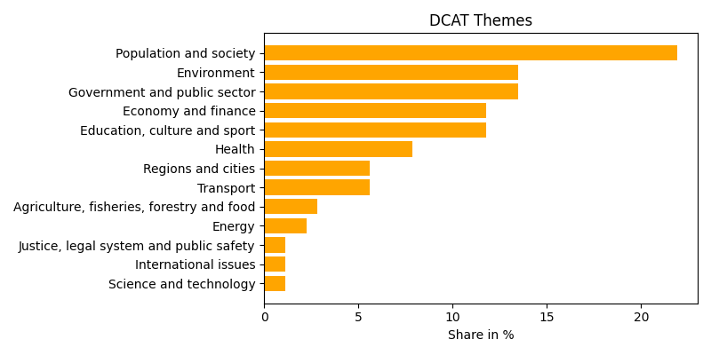
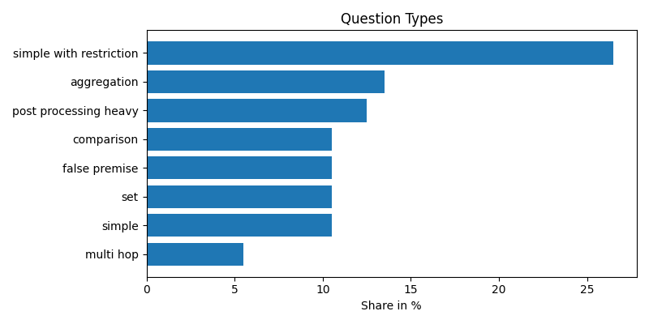

# ODQA: Agentic Open Data Question Answering

This repository hosts the resources of the **Open Data Question Answering research project (ODQA)**, 
which explores how agent-based approaches and large language models (LLMs)
can lower barriers to using open government data. It provides a benchmark 
for evaluating future LLM-based and agentic tools for this application scenario.
An initial agent implementation serves a starting point for automatic 
open data question answering and gives insights into the performance 
production-readiness of such systems.
---

## Motivation

Open data portals are central for government transparency, data-driven innovation, 
and accountability of public institutions. Yet users face challenges when accessing
open data platforms:
- Limited and inconsistent search interfaces  
- Incomplete or low-quality metadata and heterogeneous datasets
- Manual, labor-intensive workflows to answer (even simple) questions

### Typical Barriers

  

  
*Figure 2: Common barriers to accessing and using open data.*

Recent advances in **LLMs and agentic methods** offer a chance to integrate dataset search and analysis into unified frameworks. ODQA is designed to serve as a testbed for evaluating these methods.

### Workflow Overview

  

  
*Figure 1: Workflow for Open Data Question Answering.*
---

## Repository Structure

- **`open-data-benchmark/`**  
  - `en-questions.csv`, `de-questions.csv`: Question–answer pairs in English and German with task and question type labels  
  - `sources.csv`: Links questions to evidence datasets and metadata  
  - `data/`: Evidence files  
  - `metadata/`: DCAT-AP metadata descriptions  
  - `govdata-catalog/`: Snapshot of the German GovData portal (August 2025)  
- **`agent/`**: Python implementation of the ODQA agent (based on `python-langgraph`)
- **`evaluations/`**: Final human-verified evaluation results  

---

## Benchmark Overview

- **Questions**: 200 (covering diverse domains and difficulty levels)  
- **DCAT Themes**: 13 (EU vocabulary authority files)  
- **Task Types**: Dataset search, question answering  
- **Question Types**: 8 (aggregation, comparison, multi-hop, set, false premise, post-processing heavy, simple, simple with restriction)  
- **File Types**: CSV, XML (extensible)  
- **Evidence Files**: 220  

### Dataset Coverage

|  |  |
|:-----------------------------------------------:|:-----------------------------------------------------:|
|    *Figure 3: Share of DCAT themes in ODQA.*    |     *Figure 4: Share of question types in ODQA.*      |

Example questions:
- *How many speed violations occurred in Aachen in 2021?*  
- *Which German administrative district had the most asylum seekers on Dec. 31, 2023?*

---

## Agentic Setup 
The chosen agentic setup for performance evaluations on the ODQA benchmark is shown below. 
It is a starting point for future implementations which will need to integrate processing 
tools for a diverse set of file formats.

  
*Figure 5: Agentic Setup.*

The ODQA agent operationalizes the QA workflow with the help of the following components:
- **Search Tool:** queries the GovData API (or a local index)  
- **Download Tool:** retrieves & preprocesses datasets (optimized for CSV)  
- **Table Register:** centralized storage of tables with unique IDs  
- **Table Tool:** supports e.g. filtering, aggregation, and sorting  

The agent is implemented in Python with [`python-langgraph`](https://www.langchain.com/langgraph).

---

