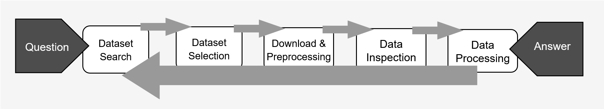
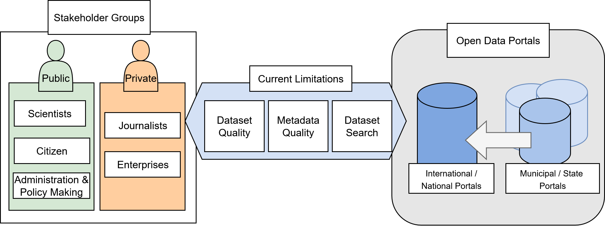
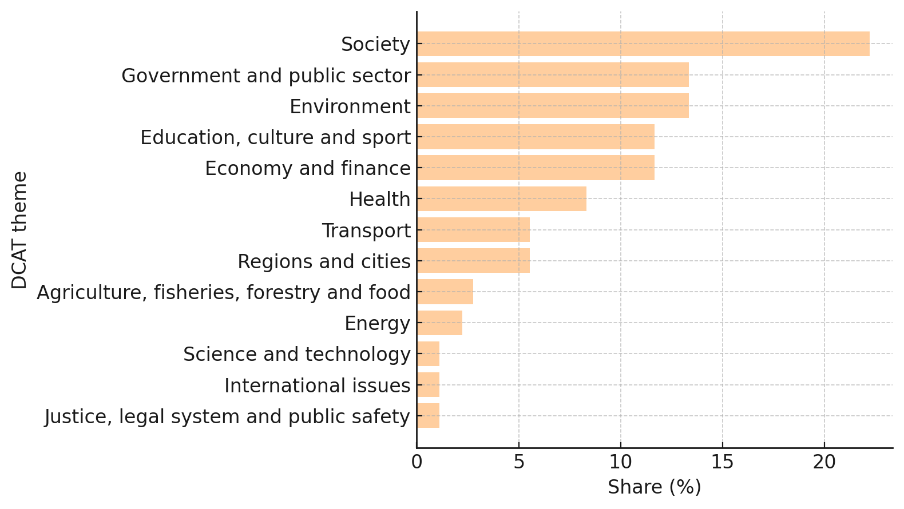
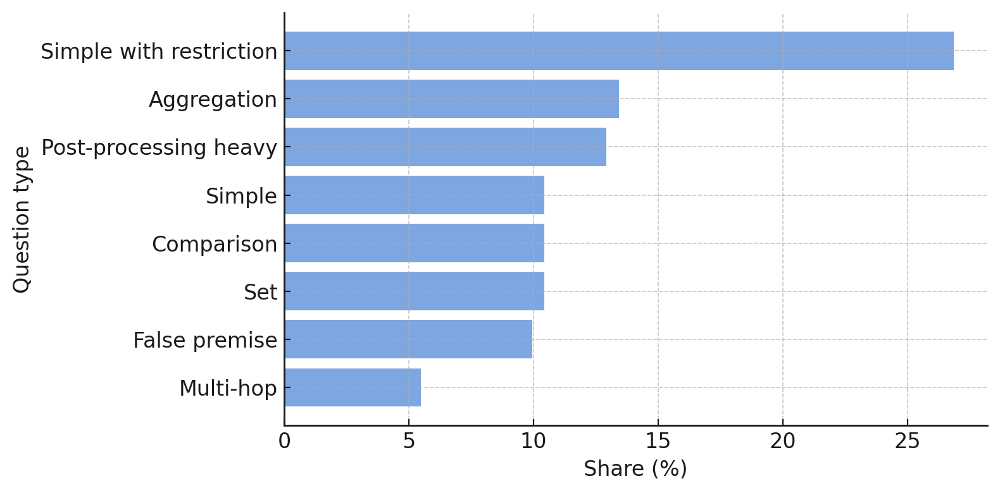
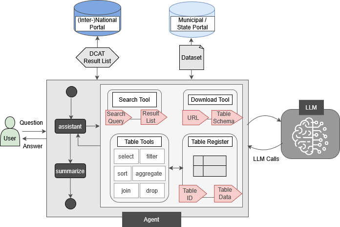

# ODQA: Agentic Open Data Question Answering

This repository hosts the resources of the **ODQA research project**, which explores how agent-based approaches and large language models (LLMs) can lower barriers to using open government data.  

ODQA provides a benchmark dataset and a modular agent framework for **open data question answering (QA)**, enabling systematic research on dataset search, analysis, and evaluation in real-world open data contexts.

---

## 📌 Motivation

Open data portals are central for transparency, innovation, and accountability. Yet users face persistent challenges:
- Limited and inconsistent search interfaces  
- Incomplete or low-quality metadata  
- Manual, labor-intensive workflows  

Recent advances in **LLMs and agentic methods** offer a chance to integrate dataset search and analysis into unified frameworks. ODQA is designed to serve as a testbed for evaluating these methods.

### Workflow Overview

  

  
*Figure 1: End-to-end workflow for open data QA.*

### Typical Barriers

  

  
*Figure 2: Common barriers to accessing and using open data.*

---

## 📂 Repository Structure

- **`open-data-benchmark/`**  
  - `en-questions.csv`, `de-questions.csv`: Question–answer pairs in English and German with task and question type labels  
  - `sources.csv`: Links questions to evidence datasets and metadata  
  - `data/`: Evidence files  
  - `metadata/`: DCAT-AP metadata descriptions  
  - `govdata-catalog/`: Snapshot of the German GovData portal (August 2025)  
- **`agent/`**: Python implementation of the ODQA agent (based on `python-langgraph`)  
- **`results/`**: Raw evaluation results from automated judging  
- **`evaluations/`**: Final human-verified evaluation results  

---

## 📊 Benchmark Overview

- **Questions**: 202 (covering diverse domains and difficulty levels)  
- **DCAT Themes**: 13 (EU vocabulary authority files)  
- **Task Types**: Dataset search, question answering  
- **Question Types**: 8 (aggregation, comparison, multi-hop, set, false premise, post-processing heavy, simple, simple with restriction)  
- **File Types**: CSV, XML (extensible)  
- **Evidence Files**: 220  

### Dataset Coverage

|  |  |
|:-----------------------------------------------:|:----------------------------------------------------:|
| *Figure 3: Share of DCAT themes in ODQA.*       | *Figure 4: Share of question types in ODQA.*         |

Example questions:
- *How many speed violations occurred in Aachen in 2021?*  
- *Which German administrative district had the most asylum seekers on Dec. 31, 2023?*

---

## 🤖 Agent Framework

The ODQA agent operationalizes the QA workflow via modular tools:
- **Search Tool** → queries the GovData API (or local index)  
- **Download Tool** → retrieves & preprocesses datasets (optimized for CSV)  
- **Table Register** → centralized storage of tables with unique IDs  
- **Table Tool** → supports filtering, merging, aggregation, and sorting  

### Architecture

  
*Figure 5: High-level architecture of the ODQA agent (ReAct-style orchestration).*

The agent is implemented in Python with [`python-langgraph`](https://www.langchain.com/langgraph).

---

## 📈 Evaluation Highlights

We benchmarked multiple LLMs in an agentic setup (Claude 3.7, GPT-5, GPT-5 Mini, Gemini 2.5 Flash, Deepseek R1, Mistral Medium 3.1) and compared them with **state-of-the-art RAG systems** (Perplexity Sonar, GPT-4o Search).

**Key findings:**
- GPT models currently achieve the strongest performance  
- GPT-5 Mini (40 recursion depth) provides the best balance of cost and performance  
- **Mistral (open-source)** is promising for further research due to **cost-effectiveness and transparency**  
- RAG systems, despite producing answers consistently, often fail to retrieve the correct datasets, signaling risks for stakeholders  

### Results Table

| Model             | Search Setup | CR    | SR    | CA    |
|-------------------|--------------|-------|-------|-------|
| Claude 3.7        | LLM Agent    | 0.550 | 0.426 | 0.775 |
| Deepseek R1       | LLM Agent    | 0.787 | 0.243 | 0.308 |
| Gemini 2.5 Flash  | LLM Agent    | 0.836 | 0.368 | 0.440 |
| GPT-5             | LLM Agent    | 0.574 | 0.535 | **0.931** |
| GPT-5 Mini        | LLM Agent    | 0.629 | 0.515 | 0.819 |
| GPT-5 Mini (40)   | LLM Agent    | 0.767 | **0.624** | 0.813 |
| Mistral Medium 3.1| LLM Agent    | 0.639 | 0.347 | 0.543 |
| GPT-4o Search     | SOTA RAG     | 0.960 | 0.233 | 0.242 |
| Perplexity Sonar  | SOTA RAG     | 0.995 | 0.257 | 0.259 |

*Metrics: CR = Completion Rate, SR = Success Rate, CA = Conditional Accuracy.*

